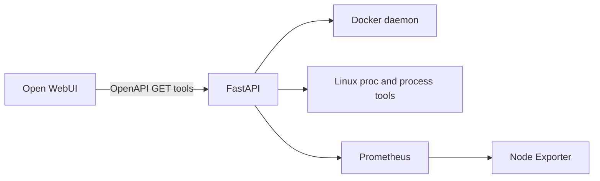

# Architecture

[Home](../README.md)

Docker status uses the Docker SDK. Host and process readings use Linux facilities. History and disk I/O use Prometheus queries. Disk resolution maps a requested path to an exported filesystem/device, including device-mapper names.

The host label is descriptive; it does not change namespace visibility. Running inside a container can change what filesystem, processes, and devices are visible. Correct host observation requires deliberate deployment configuration.

The exposed interface contains read operations only. The process itself still holds powerful access to Docker and potentially host resources. Interface shape and operating-system privilege are different security properties.
