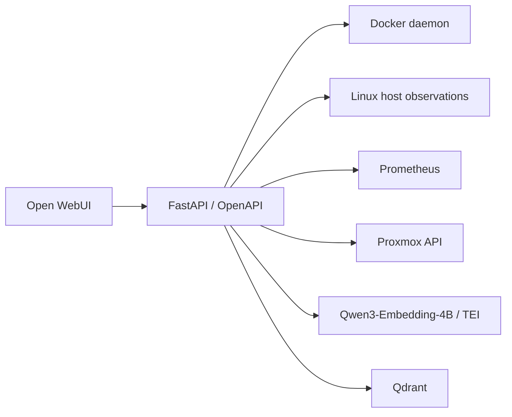

# Architecture

[Home](../README.md)

## Live telemetry and stored evidence

Docker, Linux facilities, Prometheus, and Proxmox provide operational observations. Semantic search embeds a natural-language query and returns matching document chunks with source, section, chunk sequence, file type, and score. Retrieved documents remain dated evidence; a similarity score is not factual confidence.

AI-worker status distinguishes TCP reachability from embedding-service HTTP health. Knowledge health performs an actual embedding request, reads collection state, and performs a vector query. Its query confirms a result exists, not that the corpus is complete or the result answers a representative question.

## Combined audit

The combined operation gathers seven component groups. Each group has its own success flag or error; an exception does not discard other results. `complete` means all groups returned, not that all underlying checks are healthy. Inspect the nested results.

Derived fields discourage unsupported diagnoses from slightly-above-allocation VM memory, zero indexed-vector counts, or mutable image tags. Some expected guests and containers are specific to this lab. These checks must be adapted before using the service for a different deployment.

## Privilege and visibility

Host labels do not change container namespaces. Host process, filesystem, and device observations depend on runtime mounts and namespace configuration. GET-only routes do not restrict the Docker socket or upstream credential privileges available to the process.

## Current guest expectation

As of the October 3 repository update, the combined audit's expected guest set includes VM/LXC IDs 100 through 105. The API still discovers guest telemetry dynamically from Proxmox; the expected set is used only for derived presence/running checks.

Repository state and deployed runtime state must be distinguished. Updating this source does not establish that the live container has been rebuilt or restarted.
